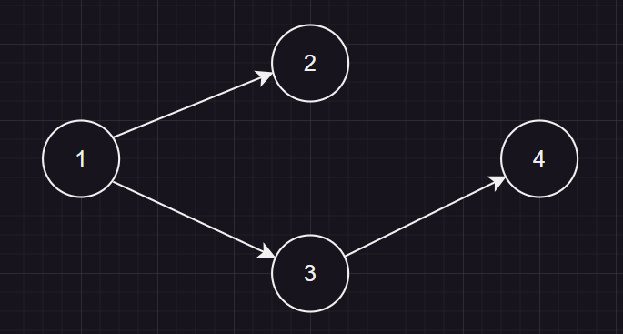
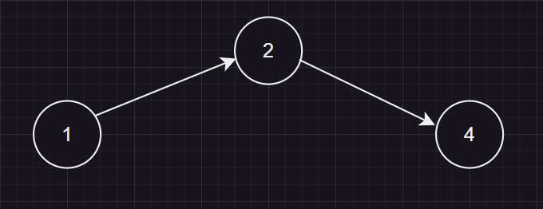

# 简介
主要用到的类有Map和Map::iterator，他们都包含在ato (Automation缩写) 这一命名空间中，所以如果要使用它们，请用**ato::Map**和**ato::Map::iterator**

<br>

## Map
Map本质是一个图，可以用来表示NFA/DFA，它的结点用来表示各个状态，它的边用来表示一个状态转移方式<br>
例如下图：

> <br>
> 这个图可以表示：<br>
> q1可以通过a到达状态q2，<br>
> q1也可以通过b到达状态q3...


<br>


## Map::iterator
iterator可以理解为一个结点，<br>
可以通过它对一个结点进行操作。<br>
如：
```C++
using namespace ato; // 使用ato命名空间
Map mp; //先创建一个空的图

// 新建一个开始状态
Map::iterator a = mp.insertNode(nodet::START);
// 新建一个结束状态（用auto更方便）
auto b = mp.insertNode(nodet::END);
// 再令状态a能通过 0 到达状态b
mp.insertEdge(a, b, '0');

// 也可以通过iterator查看结点类型
if(a.type() == nodet::START)
{
    std::cout << "A is a startNode" << '\n';
}
```

<br>
<br>
<br>
<br>


# Map
## iterator insertNode( node_t nodeType )
在图上创建一个结点

## void insertEdge( iterator from, iterator to, valt edgeVal )
在图上新建一条边，从from到to，边的值为edgeVal

## void setNodeType( iterator tar, node_t nodeType )
设置一个结点的类型（开始状态，中间状态，结束状态）

## void eraseEdge( iterator from, iterator to, valt edgeVal )
删除从from到to，且值为edgeVal的一条边

## void eraseNode( iterator& __target )
删除target结点

## iterator expandNode( iterator from, val_t edgeVal )
从from结点拓展出一个结点，边的值为edgeVal

## iterator mergeNode( iterator dest, iterator src )
将src结点合并至dest结点<br>
***注意，src的状态和边都将被dest继承***
> 一开始：<br>
> <br>
> 当3结点合并至2结点时，3到4的边被2继承<br>
> 


## void concat( const Map& rhs )
在自身后面接上另一个图（不常用）<br>
**连接：前一个图的所有结束状态连接后一个图的起始状态**

## iterator begin()
返回自身的开始状态<br>
若自身为空，则返回一个空的iterator（等价于nullptr）

## iterator_set dest()
返回自身的结束状态（一个集合）

## iterator end()
返回一个iterator(nullptr)，用于判断越界（不常用）

## bool empty()
返回自身是否为空

## void clear()
清除自身，恢复为空
<br>
<br>
<br>


# Map::iterator
## iterator()
默认构造函数

## iterator( const iterator& __rhs )
复制构造函数

## const Node* get()
获取实际结点的指针（不常用）

## node_t type()
返回结点的类型

## iterator_set next( val_t __val )
返回该结点通过val能到达的结点集合

## iterator_set revNext( val_t __val )
返回能通过val到达该点的结点集合

## void deprecate()
弃用该迭代器